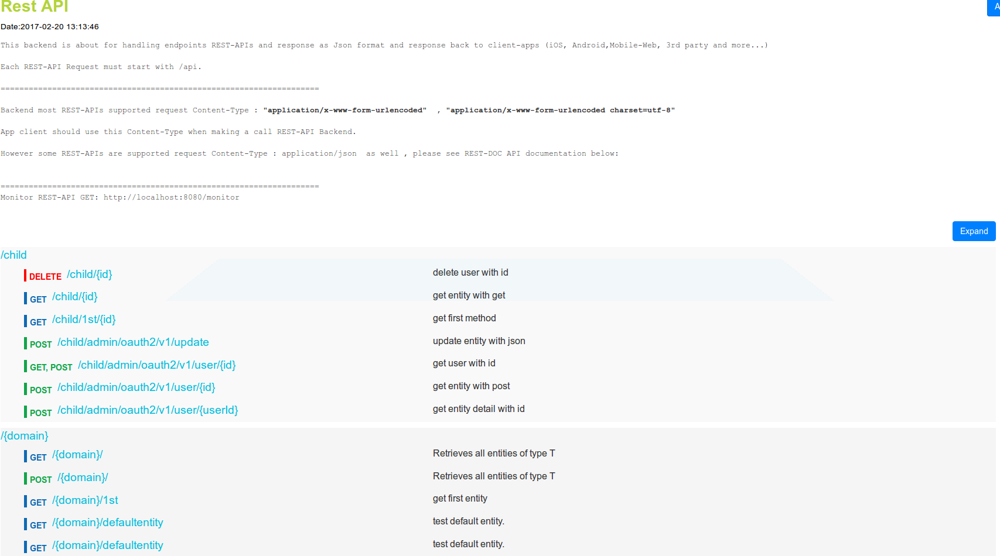
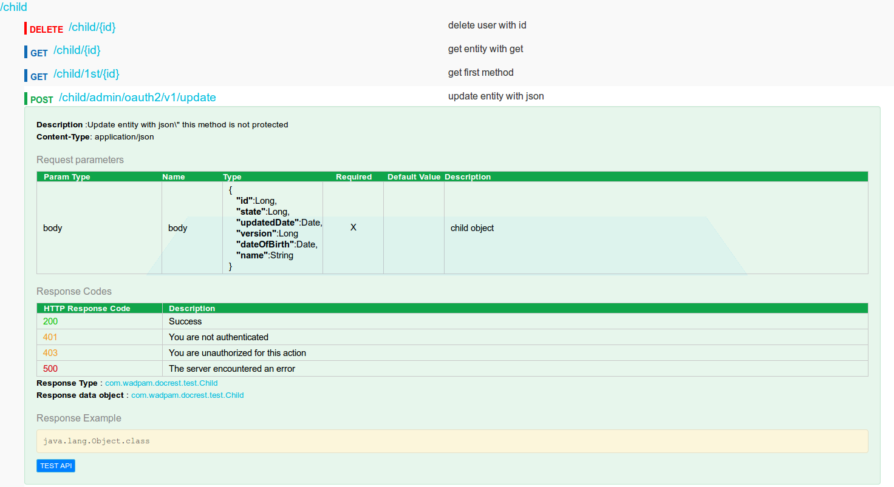
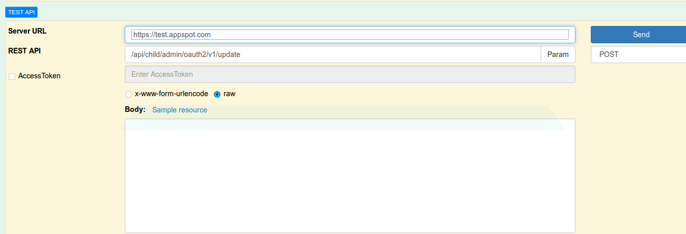
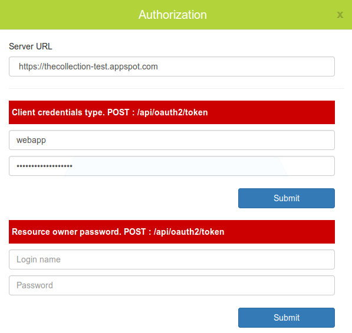
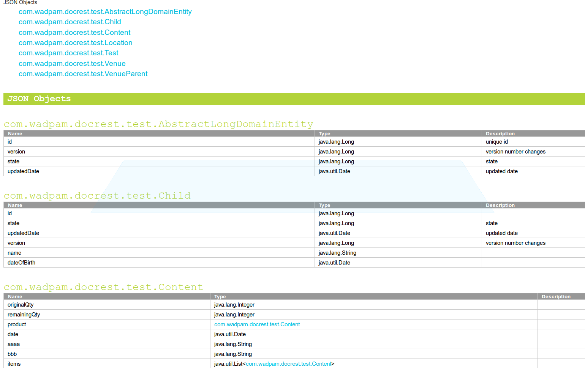

[](https://codecov.io/github/sophea/docrest?branch=master)


docrest
=======

REST API documentation how to access REST-API

Features
========

- Support swagger json 2.0 format
- html docrest pages with nice UI testing with real server
- support PostMan tool Test APIs
- integrate with oauth2 access_token flow
- support and produc curl command
- easy doc-rest annotation
- easy to integration any backend projects + spring framework

integrated with your project
============================

To use DocRest in a project please make the following changes to pom.xml with profile: mvn clean install -Pjavadoc 

```
      
        <dependency>
            <groupId>com.wadpam</groupId>
            <artifactId>docrest-doclet</artifactId>
            <version>2.0.0</version>
            <scope>compile</scope>
        </dependency>
	
 <profile>
            <id>javadoc</id>
            <build>
            <plugins>
                <plugin>
                  <artifactId>maven-dependency-plugin</artifactId>
                  <executions>
                    <execution>
                      <phase>package</phase>
                      <goals>
                        <goal>copy-dependencies</goal>
                      </goals>
                      <configuration>
                        <outputDirectory>${project.build.directory}/lib</outputDirectory>
                      </configuration>
                    </execution>
                  </executions>
                </plugin>
                <plugin>
                  <artifactId>maven-antrun-plugin</artifactId>
                  <version>1.8</version>
                  <executions>
                    <execution>
                      <phase>package</phase>
                      <configuration>
                        <!-- output dirs -->
                        <target name="docrest">
                          <property name="build.dir" location="target" />
                          <property name="lib.dir" location="${build.dir}/lib" />
                          <property name="classes" value="${build.dir}/classes" />
                          <property name="gen-src.dir" value="${build.dir}/generated-sources" />
                          <path id="buildClasspath">
                            <fileset dir="${lib.dir}">
                              <include name="**/*.jar" />
                              <exclude name="test/**" />
                            </fileset>
                            <pathelement location="${classes}" />
                          </path>
                          <javadoc sourcepath="src/main/java" author="false"
                            encoding="UTF-8" source="1.7" classpathref="buildClasspath"
                            verbose="false">
                            <doclet name="com.wadpam.docrest.DocRestDoclet"
                              pathref="buildClasspath">
                              <param name="-basePath" value="unknown" />
                              <param name="-baseUrl" value="unknown" />
                              <param name="-clientId" value="unknown" />
                              <param name="-d"
                                value="${build.dir}/docrest/${project.name}/${project.version}" />
                            </doclet>
                          </javadoc>
                        </target>
                      </configuration>
                      <goals>
                        <goal>run</goal>
                      </goals>
                    </execution>
                  </executions>
                </plugin>
              </plugins>
            </build>
        </profile>
                 
```                    

# How to use rest-doclet annotation
==================================
@RestReturn , @RestCode

     /** <p>
     * reset password is used by only user of type resource owner passwords.
     * This function will send an email as html content with a deep link to user base on appType.
     * <p/>
     * 
     * @param username Username for login value is email address.
     * @param appType Application type which is used to generate deep link send in email content. Values:
     *            <ul>
     *            <li>1 - for iOS</li>
     *            <li>2 - for Android</li>
     *            <li>3 - for web</li>
     *            </ul>
     */
    @RestReturn(highlightApiMessage = "resetpassword", value = ResponseEntity.class, entity = ResponseEntity.class,
                codes = @RestCodes(codes = "200,401,403,404,500"))
    @RequestMapping(value = "v1/user/resetpassword", method = RequestMethod.POST, params = "username")
    @ResponseStatus(HttpStatus.OK)
    @Authorization(userRoles = { UserRole.ROLE_USER_CREDENTIALS })
    public void resetPassword(HttpServletRequest request, @RequestParam String username,
            @RequestParam(required = false, defaultValue = "3") Long appType) {
    	   ...
    }


# Generate rest api documentation
 ====================================

 $ mvn clean install -Pjavadoc
 
 check the docrest site  in target/site/apidocs/api.html
 
# screen shoot
<p align="center">
  
  
  
  
  
</p>


 
# Tip
 =====
 - @RequestParam(required=false) - Please add 'required' to every RequestParam. It produces better DocRest. Value should be true or false. 
 - Optional readme-docrest.txt file directly under project directory will be used as top guideline of REST API
       
# readme-docrest.txt file
```
Optional readme-docrest.txt file directly under project directory will be used as top guideline of REST API code
backend-projectName 
   + readme-docrest.txt
   + ivy.xml
   + build.xml
   + src
   + ...
 
===================the sample content readme-docrest.txt file========
<!-- server URLs : enable for real servers -->
<script type="text/javascript">
    var serverUrls =["http://staging-m.isic.org"];
    //alert(serverUrls);
</script>
 
<pre>
This backend is about for handling endpoints REST-APIs and response as Json format and response back to client-apps (iOS, Android,Mobile-Web, 3rd party and more...)
 
Each REST-API Request must start with /api.
 
====================================================================
 
Backend most REST-APIs supported request Content-Type : <b>"application/x-www-form-urlencoded"  , "application/x-www-form-urlencoded charset=utf-8" </b>
 
App client should use this Content-Type when making a call REST-API Backend.
 
However some REST-APIs are supported request Content-Type : application/json  as well , please see REST-DOC API documentation below: 
 
  
====================================================================
Monitor REST-API GET: http://localhost:8080/monitor
 
</pre>
```
# ====Release new version and deploy===

$ mvn release:clean release:prepare

$ mvn deploy


